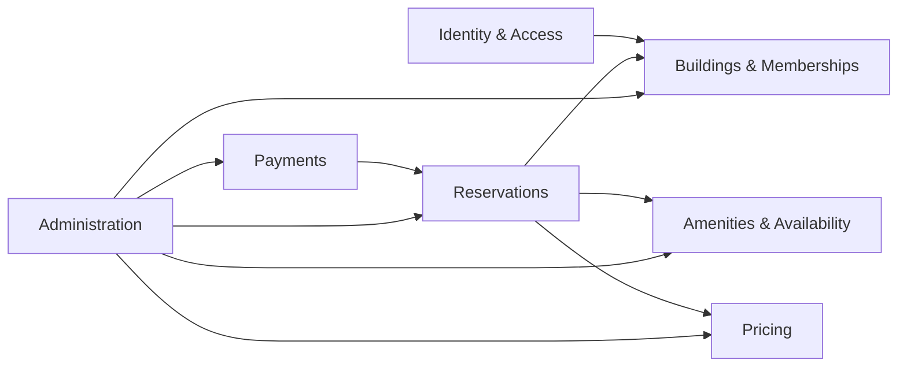

# Architecture Overview

## Style

The initial product uses a **modular monolith**. This keeps deployment and operations simple for a very small pilot while preserving internal boundaries that can evolve later if justified.

The detailed responsibilities, allowed dependencies and forbidden coupling rules are defined in [Module Boundaries](module-boundaries.md).

## Major modules

- Identity & Access
- Buildings & Memberships
- Amenities & Availability
- Reservations
- Pricing
- Payments
- Administration
- Notifications
- Messaging (post-MVP)
- Audit
- Reporting/Analytics (post-MVP)

## Core dependency direction



The direction represents business/application dependencies, not database foreign-key diagrams.

Reservations owns booking lifecycle; Pricing owns authoritative price rules; Payments owns payment attempts/provider state. These three concerns must remain conceptually separate.

## Communication rules

- Use explicit application contracts for synchronous cross-module operations.
- Use events for secondary effects such as audit/notifications.
- Do not use another module's repository/persistence implementation as an integration API.
- Avoid circular dependencies.
- Keep business entities out of generic shared/common packages.

## Runtime direction

```text
Angular + Ionic + Capacitor
            |
          HTTPS
            |
     ASP.NET Core API
       /    |     \
PostgreSQL  |   External providers
            |
        SignalR
```

## Cloud direction

Azure is the primary provider. Concrete services remain subject to cost/spike validation. Terraform will define cloud infrastructure. Managed services are preferred where they reduce operational burden.

Puppet is not required for managed container/database services. It may be used later for configuration-management learning or any VM/host-based component that genuinely needs it.

## Source-code boundary

The repository and deployment pipeline remain private. The client receives only the artifacts necessary to use the service. Sensitive business rules and authority checks stay server-side.

## Multi-tenancy direction

Core records should carry a clear building/tenant ownership path. The pilot can run as a single tenant, but domain design must avoid assumptions that every reservation belongs to one hard-coded building.

## Architecture qualities emphasized

- simplicity;
- consistency;
- explicit module boundaries;
- security boundaries;
- concurrency correctness;
- auditability;
- cost awareness;
- deployability;
- documentation.
