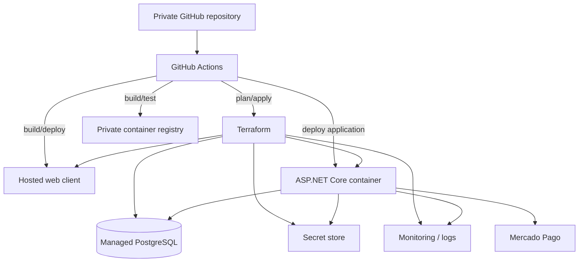

# Deployment Direction

This is a logical target, not yet a final Azure bill of materials.

## Environments

Target lifecycle:

- local development;
- staging;
- production.

Environment separation is handled through configuration/IaC/deployment environments rather than long-lived Git branches.
