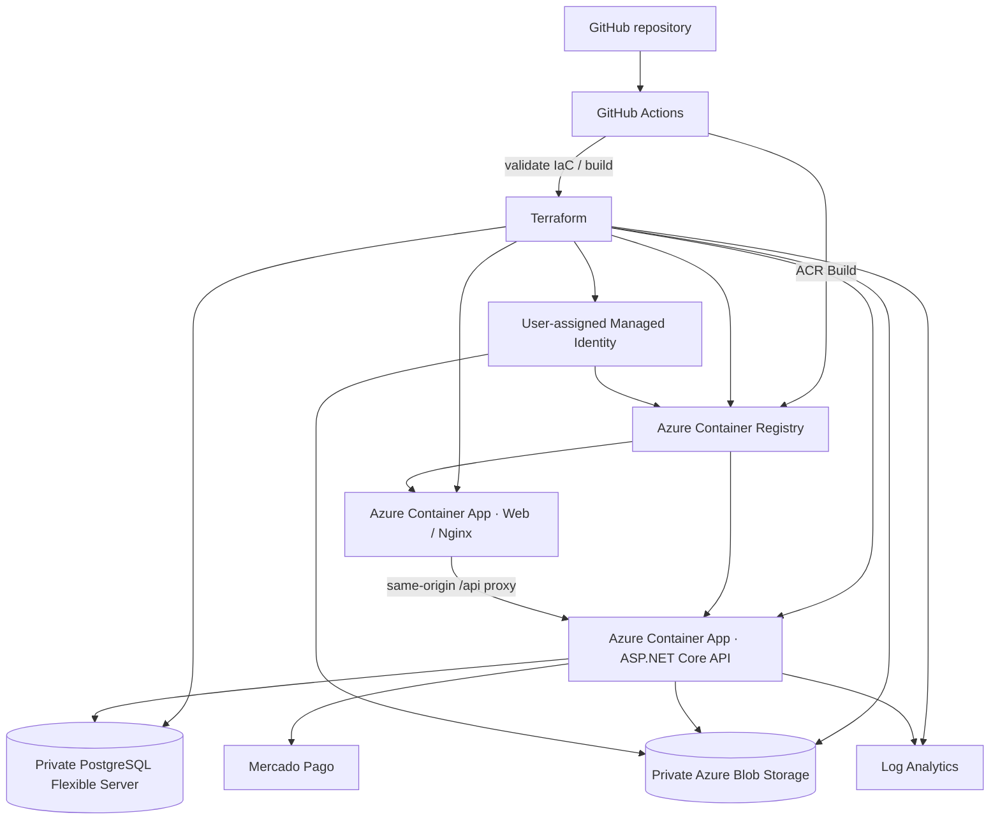

# Deployment Direction

The target Azure topology is now implemented in Terraform. The diagram below
describes the intended staging/pilot runtime. It is **not yet evidence of a live
Azure deployment** until the gated staging workflow is executed successfully.

## Networking

- Container Apps runs inside a dedicated VNet subnet.
- PostgreSQL Flexible Server uses a delegated subnet with private DNS and
  public network access disabled.
- The API Container App uses internal ingress only.
- The web Container App is public and reverse-proxies `/api/*` to the
  internal API, keeping browser traffic same-origin.

## Durable application state

- relational state: PostgreSQL Flexible Server;
- uploaded media: private Azure Blob container via managed identity;
- ASP.NET Core Data Protection key ring: private Blob container via managed identity;
- application images: ACR;
- logs: Log Analytics.

## Environments

Target lifecycle:

- local development;
- staging;
- production.

Environment separation is handled through configuration/IaC/deployment
environments rather than long-lived Git branches.
