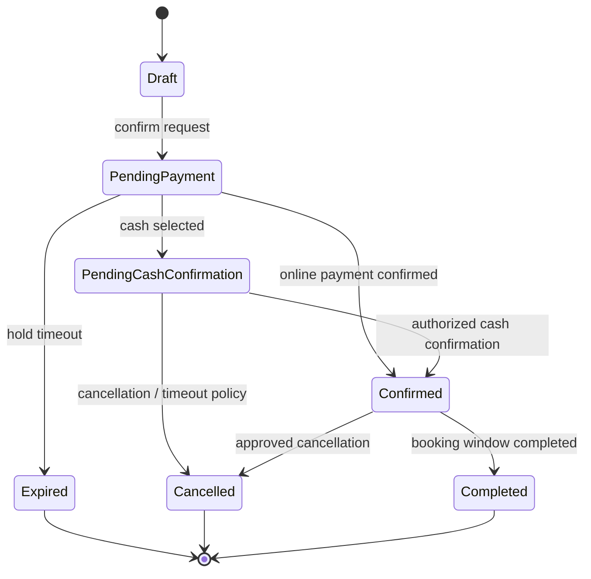

# Reservation Flow

```mermaid
stateDiagram-v2
    [*] --> Draft
    Draft --> PendingPayment: confirm request
    PendingPayment --> Confirmed: online payment confirmed
    PendingPayment --> Expired: hold timeout
    PendingPayment --> PendingCashConfirmation: cash selected
    PendingCashConfirmation --> Confirmed: authorized cash confirmation
    PendingCashConfirmation --> Cancelled: cancellation / timeout policy
    Confirmed --> Cancelled: approved cancellation
    Confirmed --> Completed: booking window completed
    Expired --> [*]
    Cancelled --> [*]
    Completed --> [*]
```

Exact states and transitions will be refined during domain modeling. This records the current conceptual lifecycle.
