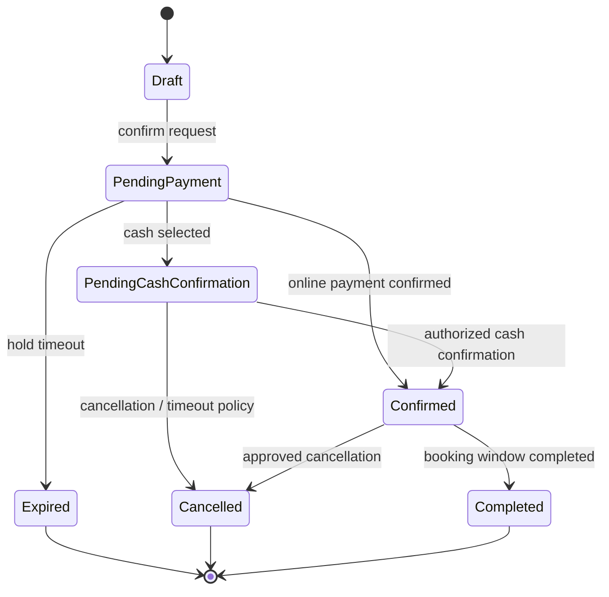
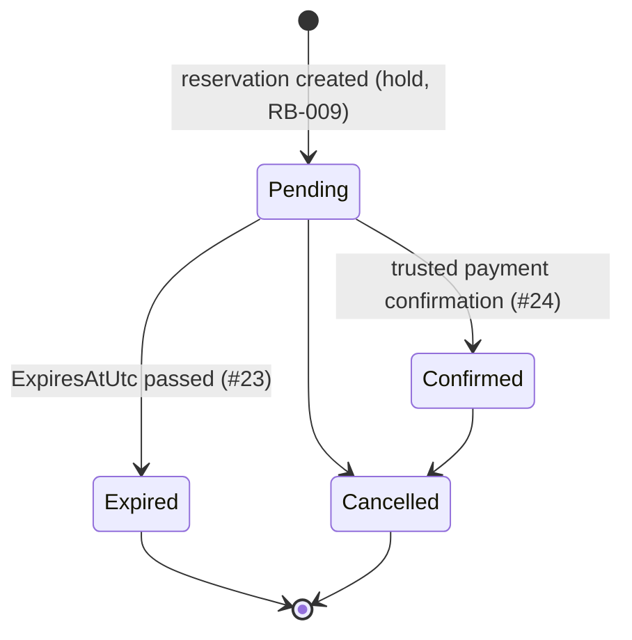

# Reservation Flow

Exact states and transitions will be refined during domain modeling. This records the current conceptual lifecycle.

## Current implementation status

Implemented as of issue #25. `Pending` is the payment hold (the conceptual
`PendingPayment` above); `Draft` and `PendingCashConfirmation` do not exist
yet.

- `Pending → Confirmed` happens **only** through Reservations'
  `ConfirmPaidReservationAsync`, called by Payments after it has verified a
  Mercado Pago order server-side (RB-011). A browser return URL never does it.
- `Pending → Expired` is the **competing** transition. Both are serialized
  on the reservation row (see
  [Payments and Mercado Pago](../../04-data/domain-model.md#payments-and-mercado-pago-issue-24)):
  exactly one wins, and a reservation can never be both.
- **`Expired` is terminal.** A payment the provider approves *after* the hold
  expired does not revive the reservation (its resources were released and
  may already belong to someone else). The payment is recorded as approved
  with an explicit `ApprovedAfterExpiry` outcome requiring manual review.
- `PendingCashConfirmation` arrives with #25; `Draft`/`Completed` are not
  implemented.
