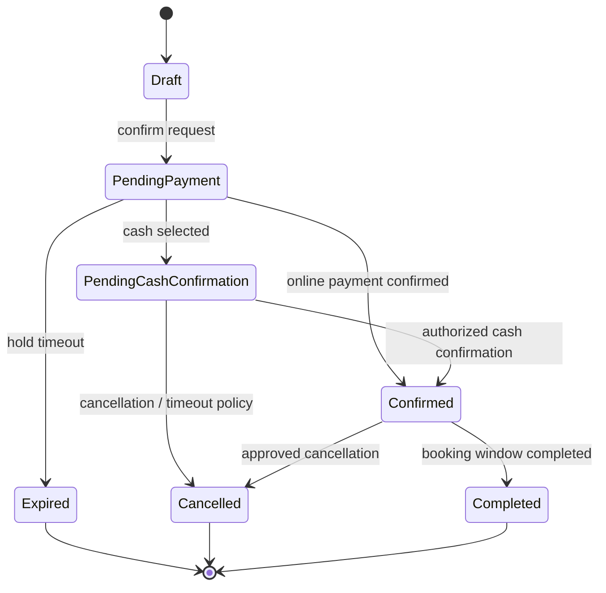

# Reservation Flow

Exact states and transitions will be refined during domain modeling. This records the current conceptual lifecycle.

## Current implementation status

Issue #20 implements only `[*] --> Confirmed` and `Confirmed --> Cancelled`
(the latter as a domain method, not yet exposed over HTTP) for Shared and
Exclusive Leisure. There is no payment step yet, so reservations skip
`Draft`/`PendingPayment` entirely and are `Confirmed` immediately on
creation. `PendingPayment`, `PendingCashConfirmation`, `Expired` and
`Completed` are introduced by #23 (holds/expiration), #24 (Mercado Pago) and
#25 (cash) as those flows are actually built — see
`docs/04-data/domain-model.md#reservations--sharedexclusive-leisure-issue-20`.
