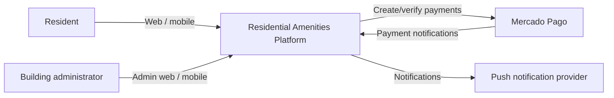

# System Context

```mermaid
flowchart LR
    Resident[Resident]
    Admin[Building administrator]
    Platform[Residential Amenities Platform]
    MP[Mercado Pago]
    Push[Push notification provider]

    Resident -->|Web / mobile| Platform
    Admin -->|Admin web / mobile| Platform
    Platform -->|Create/verify payments| MP
    MP -->|Payment notifications| Platform
    Platform -->|Notifications| Push
```

## Boundary

Residents and building administrators interact with the hosted platform. They do not receive repository, database or cloud-console access.
