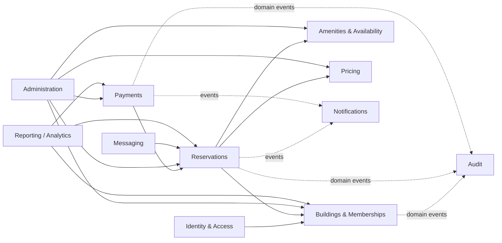

# Module Boundaries

This document refines the modular-monolith boundaries for the first backend implementation.

The goal is not to imitate microservices inside one process. The goal is to make ownership of business rules explicit so the codebase can grow without turning every feature into a cross-module dependency.

## Dependency rule

Modules may depend on another module only through an explicit application contract or stable shared abstraction. A module must not reach directly into another module's persistence implementation or internal domain objects.



Dashed arrows represent event-driven side effects/read concerns rather than synchronous business authority.

## 1. Identity & Access

### Responsibility

Own authentication and authorization primitives.

### Owns

- application identity;
- credentials / external identity references;
- login/session/token lifecycle;
- roles and authorization policies;
- security-related account state.

### Does not own

- apartment/unit assignment;
- reservation rules;
- amenity access policy;
- payment state.

### Exposes

Examples of contracts:

- current authenticated user ID;
- role/policy checks;
- account lifecycle operations.

### Dependency notes

Identity must not depend on Angular/Ionic or any frontend-specific concept. Authentication and authorization are server-side capabilities.

---

## 2. Buildings & Memberships

### Responsibility

Own the residential ownership/tenant boundary and who is authorized to act within it.

### Owns

- Building;
- Unit;
- ResidentMembership;
- membership status;
- relationship between a user and a building/unit.

### Does not own

- authentication credentials;
- reservation lifecycle;
- amenity availability;
- prices.

### Exposes

- resolve membership for a user;
- validate active membership;
- resolve building/unit ownership;
- building/tenant context.

### Important invariant

A display label such as `3A` is not a global identifier. Membership is explicit and scoped to a building.

---

## 3. Amenities & Availability

### Responsibility

Own reservable resources and the structural availability constraints that are independent of a specific reservation transaction.

### Owns

- Amenity/resource definitions;
- resource type/capability;
- operating windows;
- unavailable/maintenance periods;
- compatibility metadata needed to evaluate usage.

### Does not own

- reservation lifecycle;
- price calculation;
- payment state.

### Exposes

- resource lookup;
- configured availability windows;
- maintenance/unavailable periods;
- resource compatibility information.

### Boundary rule

The module describes when/resources can be used. The Reservations module decides whether a concrete booking can be accepted after considering existing reservations.

---

## 4. Reservations

### Responsibility

Own the booking lifecycle and enforce reservation invariants.

### Owns

- Reservation;
- ReservationResource;
- participants where applicable;
- reservation status;
- time range;
- shared vs exclusive usage;
- holds and expiration;
- cancellation/reschedule lifecycle.

### Depends on

- Buildings & Memberships: requester/building authorization context;
- Amenities & Availability: resource/time constraints;
- Pricing: authoritative quote/snapshot generation.

### Does not own

- pricing rule configuration;
- payment-provider integration;
- authentication credentials.

### Exposes

- check/create reservation;
- confirm/expire/cancel/reschedule reservation;
- query reservation state;
- reservation lifecycle events.

### Critical invariant

Two incompatible bookings must never both become valid for the same resource/time window.

---

## 5. Pricing

### Responsibility

Own price rules and authoritative price calculation.

### Owns

- PriceRule;
- effective dates;
- currency;
- amenity/use-type surcharges;
- calculation policy.

### Produces

A quote/price breakdown that Reservations snapshots into historical reservation price lines.

### Does not own

- payment collection;
- reservation status;
- UI formatting logic.

### Important invariant

Changing today's price rules must not rewrite the historical amount of an existing reservation.

---

## 6. Payments

### Responsibility

Own payment attempts, payment-provider integration and payment state.

### Owns

- Payment;
- payment method;
- provider reference IDs;
- webhook/provider events;
- cash confirmation state;
- payment idempotency.

### Depends on

- Reservations: payable reservation and amount/state required for payment coordination.

### Does not own

- reservation availability;
- price-rule calculation;
- resident membership.

### Boundary rule

Payments can report a trusted payment outcome. Reservations owns the booking transition that follows that outcome.

This intentionally prevents Mercado Pago-specific statuses from becoming reservation-domain statuses.

---

## 7. Administration

### Responsibility

Provide privileged application use cases by orchestrating existing modules.

### Owns

Primarily application workflows, not duplicate domain entities.

Examples:

- confirm cash payment;
- cancel/reschedule on behalf of a resident;
- manage prices;
- manage resource/time configuration;
- inspect reservation/payment detail.

### Boundary rule

Administration does not bypass module invariants or write tables directly. Admin powers use the same domain rules with elevated authorization where explicitly allowed.

---

## 8. Audit

### Responsibility

Record important security, financial and administrative actions.

### Owns

- AuditLog / audit event representation;
- actor;
- action;
- target;
- timestamp;
- relevant metadata.

### Consumes

Events/actions emitted by modules such as:

- Buildings & Memberships;
- Reservations;
- Payments;
- Administration;
- Identity & Access where security-relevant.

### Boundary rule

Audit recording should not become the business authority for another module.

### Administration (issue #26)

Administration is an orchestrator: it exposes `/api/admin/...` and composes read models but owns no data and never touches another module's tables. Commands go through explicit contracts implemented by the owning module (`IReservationAdminContract`, `IEventSlotAdminContract`, `IPricingAdminContract`, `IAmenityAdminContract`; read side `IReservationAdminQuery`, `IPaymentAdminQuery`), so each module keeps its own invariants. See `docs/04-data/domain-model.md#administrative-operations-issue-26`.

### Implementation (issue #27)

Modules call Audit; Audit calls no module. The public surface is
`IAuditRecorder.Record(AuditRecord)`, which only adds the entry to the current
`AppDbContext` so the owning use case controls `SaveChanges` and the
transaction (the transition and its audit entry commit together). Actors are
`User`, `System` and `ExternalProvider`; actions are a closed catalog
(`AuditAction`) and metadata is built only by typed, allowlisted
`AuditMetadata` factories. `AuditLog` has no foreign keys to other modules'
tables and is append-only. Reservations audits its own transitions as the
system (it never knows the payment provider or method); Payments audits the
real actor. See `docs/04-data/domain-model.md#audit-trail-issue-27`.

---

## 9. Notifications

### Responsibility

Translate business events into user-facing notification intents and deliveries.

### Examples

- reservation confirmed;
- hold expiring;
- payment confirmed;
- shared participant joined;
- upcoming reservation reminder.

### Boundary rule

A notification failure must not roll back a successfully completed core reservation/payment transaction unless a future business rule explicitly requires it.

---

## 10. Messaging — post-MVP

### Responsibility

Provide communication scoped to a valid reservation/shared-use context.

### Owns

- conversation/message data;
- message authorization;
- realtime delivery integration.

### Depends on

Reservations to validate the conversation context and participants.

### Explicit non-goal

This module is not a general-purpose social network or building-wide WhatsApp replacement.

---

## 11. Reporting / Analytics — post-MVP

### Responsibility

Provide read-oriented metrics and reports without becoming the source of truth for operational workflows.

### Examples

- bookings per period;
- revenue;
- utilization;
- payment-method distribution;
- resource demand.

### Boundary rule

Reporting may consume/query operational data through defined read models, but business commands must continue to go through their owning modules.

---

# Cross-module communication

Use three mechanisms deliberately.

## 1. Direct application contract

For synchronous information required to complete a command.

Example:

```text
Reservations
  -> Buildings & Memberships: validate active membership
  -> Amenities & Availability: load resource constraints
  -> Pricing: calculate quote
```

## 2. Domain/application event

For side effects that do not own the originating transaction.

Example:

```text
ReservationConfirmed
  -> Audit
  -> Notifications
```

## 3. Read model/query

For dashboards/reporting where joining operational data is useful but must not create command coupling.

# Forbidden coupling

The following patterns are not allowed:

- frontend deciding authoritative roles, prices or payment confirmation;
- Payments directly editing reservation tables;
- Administration bypassing reservation/payment APIs/services to mutate persistence;
- one module importing another module's ORM repositories/DbSet as its normal integration contract;
- shared "Common" project becoming a dumping ground for business entities;
- circular dependencies between domain/application modules;
- Mercado Pago DTOs leaking into Reservation domain models.

# Shared technical kernel

A very small shared technical layer is acceptable for non-business primitives such as:

- `Result/Error` abstractions;
- clock/time provider interface;
- correlation/request IDs;
- base event interface;
- pagination primitives.

Business concepts such as Reservation, Payment, Building or PriceRule do not belong in a generic shared kernel.

# Proposed backend solution direction

The exact .NET project layout will be validated in the technical spike, but the logical target is:

```text
apps/api/
  src/
    Api/
    Modules/
      Identity/
      Buildings/
      Amenities/
      Reservations/
      Pricing/
      Payments/
      Administration/
      Audit/
      Notifications/
  tests/
    Unit/
    Integration/
```

Whether every logical module becomes a separate .NET project immediately is intentionally left open for the toolchain/scaffold spike. Boundary quality matters more than generating many projects.

# Evolution rule

A module becomes a separate deployable service only when there is concrete evidence such as:

- independent scaling pressure;
- significantly different availability/security boundary;
- ownership by a separate team;
- operational isolation need;
- technology constraint that cannot be handled cleanly in-process.

"Microservices look more professional" is not sufficient justification.
