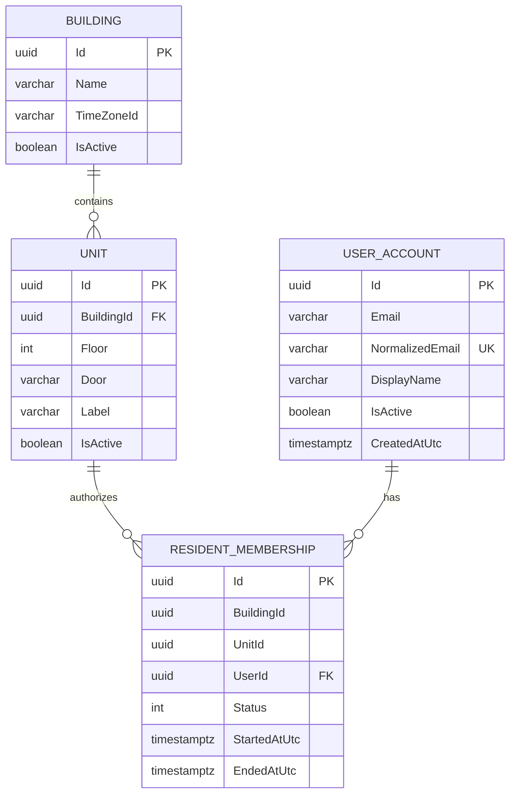
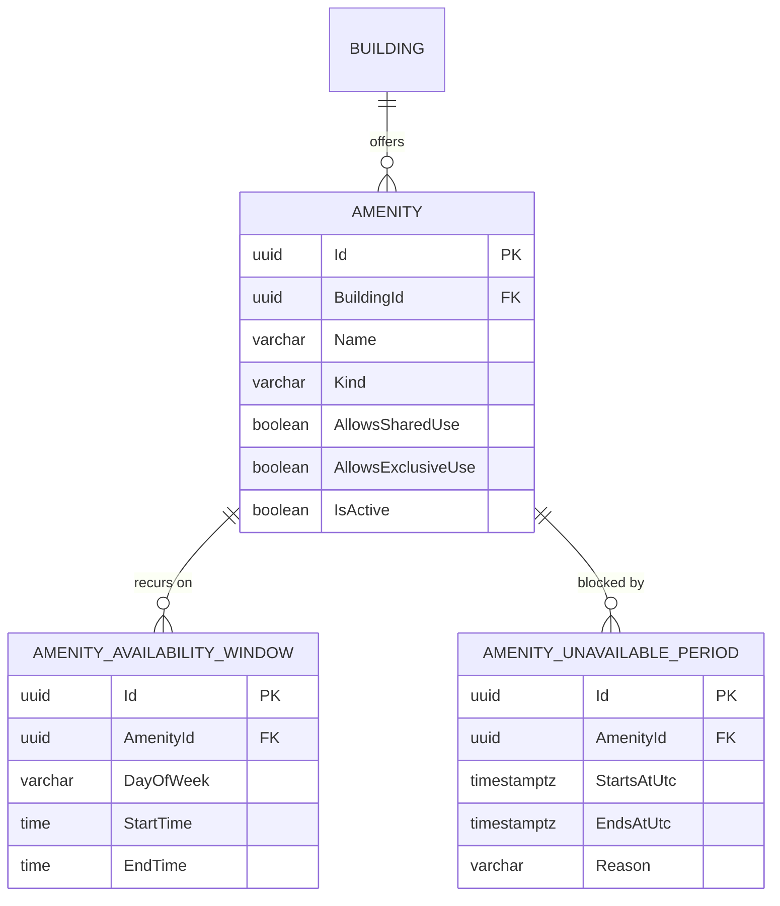
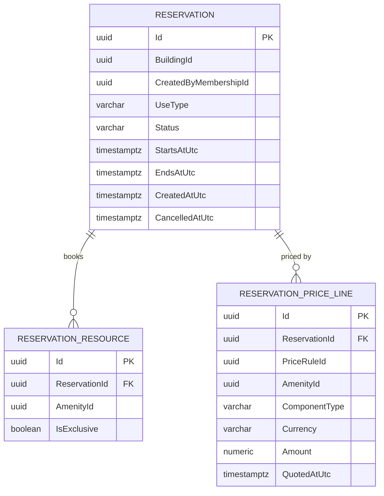
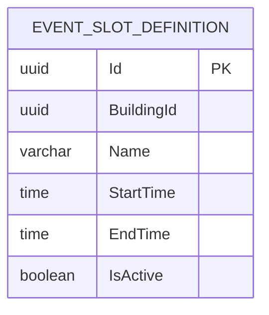

# Domain Model — v0.6

## Implemented foundation

Issue #9 introduces the first persisted domain slice. The model is deliberately tenant/building-aware while the pilot still operates with one building.

| Entity | Status | Purpose |
| --- | --- | --- |
| Building | Implemented | Building/tenant ownership boundary. |
| Unit | Implemented | Residential unit belonging to a building. |
| UserAccount | Implemented foundation | Stable identity/profile anchor. Credentials, login sessions and roles are deferred to #10. |
| ResidentMembership | Implemented | Authorized relationship between a user, building and unit. |
| Amenity | Implemented (issue #19) | Reservable resource such as SUM, pool or barbecue/grill. |
| AmenityAvailabilityWindow | Implemented (issue #19) | Recurring weekly operating window for an amenity. |
| AmenityUnavailablePeriod | Implemented (issue #19) | Maintenance/blackout override for an amenity. |
| Reservation | Implemented (issues #20, #21) | Booking aggregate root; Shared/Exclusive Leisure and Event. |
| ReservationResource | Implemented (issues #20, #21) | Resource(s) attached to a reservation, with per-resource exclusivity; Event attaches base + add-ons. |
| ReservationParticipant | Planned/TBD | Participants in compatible/shared usage if required by the final reservation model. |
| EventSlotDefinition | Implemented (issue #21) | Configured, bookable time-of-day window for Event reservations. |
| PriceRule | Implemented (issue #22) | Configurable, effective-dated pricing rule. |
| ReservationPriceLine | Implemented (issues #20, #21) | Historical snapshot of a `PriceQuoteLine`, copied onto a reservation at booking time; one row per priced component (base + each add-on). |
| Payment | Planned | Payment attempt/record and method/status. |
| PaymentEvent | Planned | Idempotent provider/payment lifecycle event where useful. |
| Message | Post-MVP | Reservation-scoped communication. |
| Notification | Post-MVP | Notification intent/delivery record. |
| AuditLog | Planned | Important administrative/security/domain actions. |

## Implemented relationship model



## Tenant-safety constraint

`ResidentMembership` stores both `BuildingId` and `UnitId`. Its database foreign key is composite:

```text
ResidentMembership(BuildingId, UnitId)
                ↓
Unit(BuildingId, Id)
```

This deliberately prevents a membership in one building from referencing a unit owned by another building, even if persistence is accessed outside the normal application flow.

## Pilot development seed

Development startup seeds one pilot building plus these units:

```text
1A  1B
2A  2B
3A  3B
4A  4B
5A  5B
```

The seed runs only in the ASP.NET Core Development environment and is idempotent by building/unit identifiers. It is development bootstrap data, not production onboarding logic.

## Amenities & Availability (issue #19)



The availability query (`AmenityAvailabilityCalculator`) is a pure, DB-independent
function of an amenity's windows/periods plus its building's `TimeZoneId`. It has no
knowledge of Reservations; see [Data Dictionary](data-dictionary.md#availability-query)
and `docs/03-architecture/module-boundaries.md` for the ownership boundary.

## Pricing (issue #22)

`PriceRule` is owned by the Pricing module and referenced by `AmenityId` only
(no EF navigation to `Amenity`), per the module-boundary rule against
sharing another module's entities. `PricingCalculator` is a pure function of
already-loaded rules — no DB/HTTP dependency — that selects the rule
effective at a given instant per (amenity, component, use type) and sums a
base component with any add-ons into a `PriceQuote`.

Historical correctness (RB-008, RF-009) comes from `PriceRule.Supersede`
closing a rule's `EffectiveToUtc` instead of mutating its `Amount`: a quote
calculated for a past instant keeps resolving to the rule that was active
then. `ReservationPriceLine` does not exist yet — Reservations will
persist a copy of each `PriceQuoteLine` (rule id, amount, currency) once it
can attach them to a real reservation.

See [Data Dictionary](data-dictionary.md#pricerules) for column detail and
the pilot's placeholder amounts.

## Reservations — Shared/Exclusive Leisure (issue #20)



### Scope of this issue

Covers RF-004 (shared leisure), RF-005 (exclusive leisure), RB-003, RB-004 and
RB-005. `UseType` reuses Pricing's `ReservationUseType` enum directly (see
[Data Dictionary](data-dictionary.md#reservations)) rather than duplicating
it, since Reservations already depends on Pricing per
`docs/03-architecture/module-boundaries.md` and both need the exact same
value to select a price rule. The enum already has an `Event` member so
issue #21 does not need a model-breaking change; this issue's endpoint
rejects `Event` explicitly (not yet implemented) rather than silently
accepting it.

### Lifecycle (deliberately minimal for now)

Only `Confirmed` and `Cancelled` exist. There is no payment-hold state yet —
every reservation created by this issue is `Confirmed` immediately, because
no payment step exists to hold it. `PendingPayment`/`Expired`/hold-expiry
states belong to #23 (concurrency/holds) and #24/#25 (Mercado
Pago/cash); they are intentionally not added now so the codebase has no
dead states without the logic that gives them meaning.

### Compatibility &amp; overlap (RB-003, RB-005, RF-010)

Centralized in `ReservationCompatibility` (pure, unit-tested): two ranges
overlap when `existing.Start < requested.End && requested.Start <
existing.End` (contiguous ranges do not overlap), and a conflict exists when
the ranges overlap **and** either side is exclusive. Shared+Shared is always
compatible today. Evaluated per `ReservationResource`/Amenity, never per
building or per reservation, so booking the SUM does not block unrelated
amenities.

Maximum shared-use capacity is explicitly **not** decided (`docs/02-requirements/business-rules.md`
RB-016 — pending issue #2). Until it exists, any number of compatible Shared
Leisure reservations may coexist for the same resource/time; the capacity
check has an obvious seam to add once issue #2 answers OQ-* on this, but
inventing a number now (e.g. hardcoding "2") was explicitly out of scope.

Conflict detection here is ordinary transactional
read-then-write checking, run inside the same `DbContext`/transaction as the
insert. **It does not by itself make two truly concurrent incompatible
requests impossible** — closing that race with real database-level
concurrency controls (e.g. exclusion constraints, advisory locks) is
issue #23's job. RNF-005 is not considered fully satisfied by this issue.

### Pricing snapshot (RB-008, RF-009)

`ReservationPriceLine` is populated at creation time by calling
`PricingCalculator.Calculate` (Pricing module) and copying each
`PriceQuoteLine` verbatim — `PriceRuleId`, `AmenityId`, `ComponentType`,
`Currency` and `Amount` — onto the reservation. `PriceRuleId`/`AmenityId` are
plain historical ids with **no foreign key** to `PriceRules`/`Amenities`, so
this history stays valid even if that rule is later superseded or the
amenity changes; the reservation's total is always the sum of its own
`ReservationPriceLine.Amount` values, never a re-calculation against current
rules.

### Availability reuse

Reservation creation calls `AmenityAvailabilityCalculator.CalculateOpenIntervals`
(Amenities module) directly — the calculator itself is not duplicated. The
requested range must be fully covered by the returned open intervals or the
request is rejected; this already accounts for maintenance/unavailable
periods.

## Event reservations (issue #21)

Extends the same `Reservation`/`ReservationResource`/`ReservationPriceLine`
model from #20 to `ReservationUseType.Event` — no parallel model or service.
`ReservationCreationService` resolves a use-type-specific list of
`(Amenity, IsExclusive)` "planned resources" (one for Leisure; base + add-ons
for Event) and then runs one shared pipeline — availability, conflict
detection, pricing, persistence — over that list, so Leisure and Event never
duplicate those stages.

### SUM as base, Pool/Barbecue as add-ons (RB-001, RB-002)

An Event's base resource must be an active `Amenity` in the same building
with `Kind == AmenityKind.Sum` and `AllowsExclusiveUse == true` — checked
against the kind enum, never the `"SUM"` name/label. Each optional add-on
must have `Kind` in `{ Pool, Barbecue }` (`AmenityKind.Other` is explicitly
rejected — issue #21 does not open a general add-on mechanism), belong to
the same building, be active, allow exclusive use, and not repeat the base
or another add-on.

### Exclusivity (RB-006)

Every resource an Event books — the SUM and each add-on — is reserved with
`IsExclusive = true` for the whole range: the event blocks any other
incompatible use of *each* of its resources, not just the SUM. Conflict
detection is evaluated per `AmenityId` exactly as in #20
(`ReservationCompatibility.ConflictsWith`); if any one resource conflicts
(e.g. the SUM is free but the Pool has an incompatible booking), the entire
Event is rejected and nothing is persisted (one `SaveChanges` call for the
whole aggregate).

Pool's pilot seed data now sets `AllowsExclusiveUse = true` (previously only
shared) specifically so it can serve as an exclusive Event add-on; a
resident booking Pool exclusively on its own, outside an Event, is not
implemented yet (OQ-014, still open).

### Event slots vs. amenity availability — a deliberate distinction

`AmenityAvailabilityWindow` (#19) expresses when a resource is
physically/operationally usable at all. `EventSlotDefinition` is a
**separate** entity expressing the commercial policy of which windows within
that availability may be booked as an Event (e.g. an "afternoon" or
"evening" shift). Conflating the two was explicitly avoided: it would force
Amenities to encode reservation/business policy it does not own.



A request's `startsAtUtc`/`endsAtUtc`, converted to the building's local
time zone, must match an active `EventSlotDefinition`'s `StartTime`/`EndTime`
**exactly** (and not cross midnight — overnight/full-day slots are not
supported yet). An Event that happens to fall inside the SUM's general
availability but does not match a configured slot (e.g. 13:17–16:43) is
rejected — availability and slot policy are independent checks and both must
pass.

**Exact Event slot times remain configurable/TBD pending issue #2**
(OQ-001/OQ-002: afternoon/night shift boundaries; OQ-003: whether full-day
belongs in the MVP). Seeded slot names/times are explicit placeholders, not
an approved policy. Full-day is not implemented; if it is added later it is
expected to be a composition of slots (or a slot spanning the full
day-defined-as-available-hours), not a new hardcoded rule — but that
decision itself is not made by this issue.

### Pricing composition

Unchanged from #22/#20: `PricingCalculator.Calculate(rules, baseAmenityId,
ReservationUseType.Event, addOnAmenityIds, atUtc)` selects the effective
`SUM/Base/Event` rule plus one `.../AddOn/Event` rule per add-on, and
currency consistency across all of them is already enforced by
`PricingCalculator` itself (reused, not reimplemented). Each returned
`PriceQuoteLine` becomes one `ReservationPriceLine`, so an Event with two
add-ons snapshots three rows (base + 2), and the total is their sum — e.g.
15,000 (SUM) + 3,000 (Pool) + 3,000 (Barbecue) = 21,000 ARS with the pilot's
placeholder pricing.

### Lifecycle

Same as #20: `Confirmed`/`Cancelled` only. An Event is `Confirmed`
immediately because no payment step exists yet; `PendingPayment`/holds are
#23/#24/#25, not simulated here.

### Concurrency

Same limit as #20: ordinary transactional read-then-write, now checked
across every planned resource. It does not close the race between two truly
concurrent incompatible requests for any of an Event's resources — #23
still owns RNF-005.

## Identity boundary

`UserAccount` exists now because memberships need a stable user foreign key. It intentionally does **not** implement authentication credentials or authorization roles.

Issue #10 owns:

- login/authentication;
- password or external identity strategy;
- Resident/Admin authorization;
- secure session/token lifecycle.

This preserves the architecture boundary between identity data and building membership.

## Data-model principles

- Use stable UUIDs; labels such as `3A` are display/business identifiers scoped to a building, not global IDs.
- Preserve tenant/building ownership paths.
- Enforce important ownership invariants at both application and database level.
- Represent money with explicit currency and a precise decimal/minor-unit strategy when Pricing is introduced.
- Store timestamps with timezone-safe PostgreSQL semantics.
- Historical booking/payment facts must not be rewritten by later configuration changes.
- Avoid hard deletion for records required for financial/audit history.

See [Data Dictionary](data-dictionary.md) for the persisted v0.2 fields and constraints.
