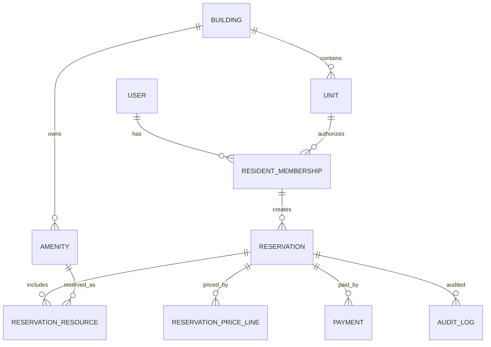

# Domain Model — v0.1

## Candidate entities

| Entity | Purpose |
| --- | --- |
| Building | Building/tenant ownership boundary. |
| Unit | Residential unit belonging to a building. |
| User | Authenticated identity. |
| ResidentMembership | Relationship between user, unit/building and role/status. |
| Amenity | Reservable resource such as SUM, pool or barbecue/grill. |
| Reservation | Booking request and lifecycle. |
| ReservationResource | Resources attached to a reservation. |
| ReservationParticipant | Users/memberships participating in compatible/shared usage if required by final model. |
| PriceRule | Configurable pricing rule with effective period. |
| ReservationPriceLine | Snapshot of applied price components. |
| Payment | Payment attempt/record and method/status. |
| PaymentEvent | Idempotent provider/payment lifecycle event record where useful. |
| Message | Reservation-scoped communication (post-MVP). |
| Notification | Notification intent/delivery record (post-MVP). |
| AuditLog | Important administrative/security/domain actions. |

## Initial relationship sketch

## Data-model principles

- Use stable IDs; display labels like `3A` are not global identifiers.
- Preserve tenant/building ownership paths.
- Represent money with explicit currency and a precise decimal/minor-unit strategy.
- Store timestamps with timezone-safe semantics.
- Historical booking/payment facts are not rewritten by later configuration changes.
- Avoid hard deletion for records required for financial/audit history.

A detailed ERD and data dictionary will be created after the first stakeholder validation pass.
