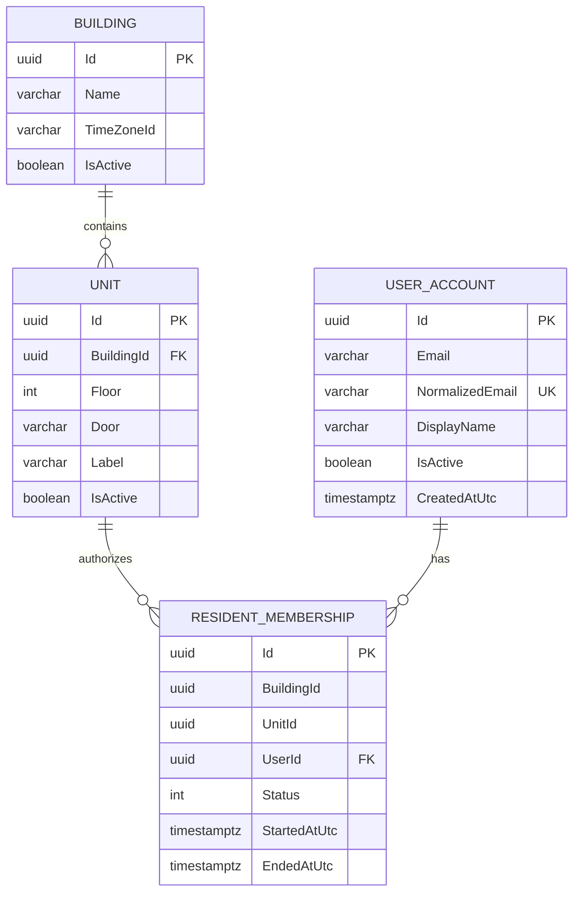
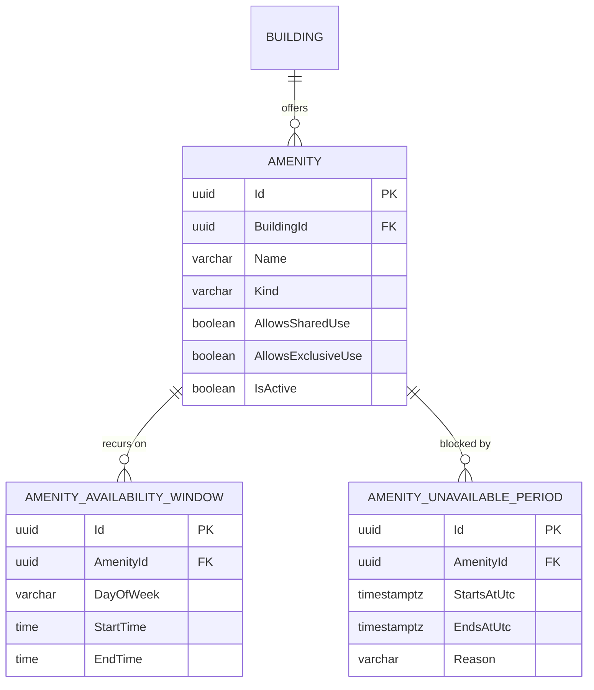

# Domain Model — v0.4

## Implemented foundation

Issue #9 introduces the first persisted domain slice. The model is deliberately tenant/building-aware while the pilot still operates with one building.

| Entity | Status | Purpose |
| --- | --- | --- |
| Building | Implemented | Building/tenant ownership boundary. |
| Unit | Implemented | Residential unit belonging to a building. |
| UserAccount | Implemented foundation | Stable identity/profile anchor. Credentials, login sessions and roles are deferred to #10. |
| ResidentMembership | Implemented | Authorized relationship between a user, building and unit. |
| Amenity | Implemented (issue #19) | Reservable resource such as SUM, pool or barbecue/grill. |
| AmenityAvailabilityWindow | Implemented (issue #19) | Recurring weekly operating window for an amenity. |
| AmenityUnavailablePeriod | Implemented (issue #19) | Maintenance/blackout override for an amenity. |
| Reservation | Planned | Booking request and lifecycle. |
| ReservationResource | Planned | Resources attached to a reservation. |
| ReservationParticipant | Planned/TBD | Participants in compatible/shared usage if required by the final reservation model. |
| PriceRule | Implemented (issue #22) | Configurable, effective-dated pricing rule. |
| ReservationPriceLine | Planned (Reservations, #20/#21/#23) | Snapshot of a `PriceQuoteLine` copied onto a reservation at booking time. |
| Payment | Planned | Payment attempt/record and method/status. |
| PaymentEvent | Planned | Idempotent provider/payment lifecycle event where useful. |
| Message | Post-MVP | Reservation-scoped communication. |
| Notification | Post-MVP | Notification intent/delivery record. |
| AuditLog | Planned | Important administrative/security/domain actions. |

## Implemented relationship model



## Tenant-safety constraint

`ResidentMembership` stores both `BuildingId` and `UnitId`. Its database foreign key is composite:

```text
ResidentMembership(BuildingId, UnitId)
                ↓
Unit(BuildingId, Id)
```

This deliberately prevents a membership in one building from referencing a unit owned by another building, even if persistence is accessed outside the normal application flow.

## Pilot development seed

Development startup seeds one pilot building plus these units:

```text
1A  1B
2A  2B
3A  3B
4A  4B
5A  5B
```

The seed runs only in the ASP.NET Core Development environment and is idempotent by building/unit identifiers. It is development bootstrap data, not production onboarding logic.

## Amenities & Availability (issue #19)



The availability query (`AmenityAvailabilityCalculator`) is a pure, DB-independent
function of an amenity's windows/periods plus its building's `TimeZoneId`. It has no
knowledge of Reservations; see [Data Dictionary](data-dictionary.md#availability-query)
and `docs/03-architecture/module-boundaries.md` for the ownership boundary.

## Pricing (issue #22)

`PriceRule` is owned by the Pricing module and referenced by `AmenityId` only
(no EF navigation to `Amenity`), per the module-boundary rule against
sharing another module's entities. `PricingCalculator` is a pure function of
already-loaded rules — no DB/HTTP dependency — that selects the rule
effective at a given instant per (amenity, component, use type) and sums a
base component with any add-ons into a `PriceQuote`.

Historical correctness (RB-008, RF-009) comes from `PriceRule.Supersede`
closing a rule's `EffectiveToUtc` instead of mutating its `Amount`: a quote
calculated for a past instant keeps resolving to the rule that was active
then. `ReservationPriceLine` does not exist yet — Reservations will
persist a copy of each `PriceQuoteLine` (rule id, amount, currency) once it
can attach them to a real reservation.

See [Data Dictionary](data-dictionary.md#pricerules) for column detail and
the pilot's placeholder amounts.

## Identity boundary

`UserAccount` exists now because memberships need a stable user foreign key. It intentionally does **not** implement authentication credentials or authorization roles.

Issue #10 owns:

- login/authentication;
- password or external identity strategy;
- Resident/Admin authorization;
- secure session/token lifecycle.

This preserves the architecture boundary between identity data and building membership.

## Data-model principles

- Use stable UUIDs; labels such as `3A` are display/business identifiers scoped to a building, not global IDs.
- Preserve tenant/building ownership paths.
- Enforce important ownership invariants at both application and database level.
- Represent money with explicit currency and a precise decimal/minor-unit strategy when Pricing is introduced.
- Store timestamps with timezone-safe PostgreSQL semantics.
- Historical booking/payment facts must not be rewritten by later configuration changes.
- Avoid hard deletion for records required for financial/audit history.

See [Data Dictionary](data-dictionary.md) for the persisted v0.2 fields and constraints.
