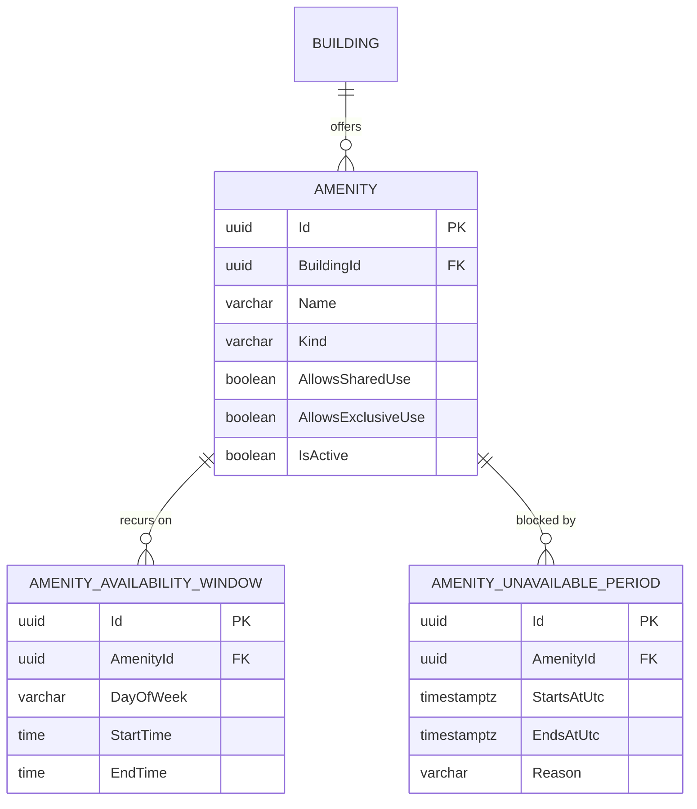
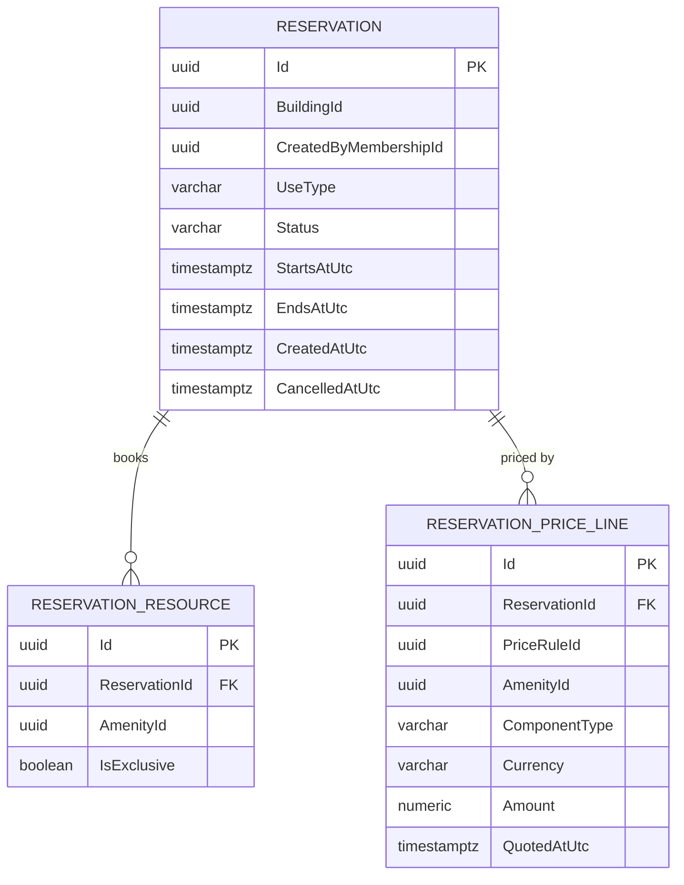
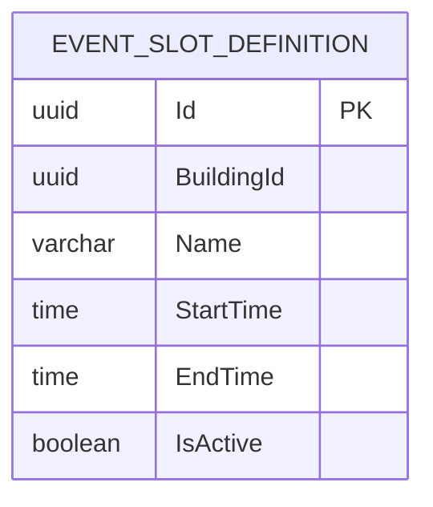
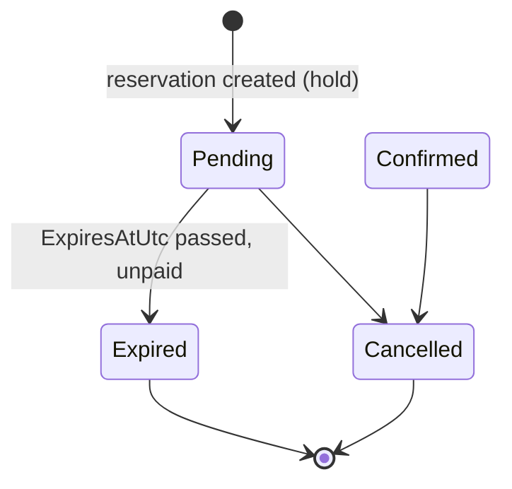

# Domain Model — v0.10

## Implemented foundation

Issue #9 introduces the first persisted domain slice. The model is deliberately tenant/building-aware while the pilot still operates with one building.

| Entity | Status | Purpose |
| --- | --- | --- |
| Building | Implemented | Building/tenant ownership boundary. |
| Unit | Implemented | Residential unit belonging to a building. |
| UserAccount | Implemented foundation | Stable identity/profile anchor. Credentials, login sessions and roles are deferred to #10. |
| ResidentMembership | Implemented | Authorized relationship between a user, building and unit. |
| Amenity | Implemented (issue #19) | Reservable resource such as SUM, pool or barbecue/grill. |
| AmenityAvailabilityWindow | Implemented (issue #19) | Recurring weekly operating window for an amenity. |
| AmenityUnavailablePeriod | Implemented (issue #19) | Maintenance/blackout override for an amenity. |
| Reservation | Implemented (issues #20, #21, #23) | Booking aggregate root; Shared/Exclusive Leisure and Event; hold/expiration lifecycle. |
| ReservationResource | Implemented (issues #20, #21) | Resource(s) attached to a reservation, with per-resource exclusivity; Event attaches base + add-ons. |
| ReservationParticipant | Planned/TBD | Participants in compatible/shared usage if required by the final reservation model. |
| EventSlotDefinition | Implemented (issue #21) | Configured, bookable time-of-day window for Event reservations. |
| PriceRule | Implemented (issue #22) | Configurable, effective-dated pricing rule. |
| ReservationPriceLine | Implemented (issues #20, #21) | Historical snapshot of a `PriceQuoteLine`, copied onto a reservation at booking time; one row per priced component (base + each add-on). |
| Payment | Implemented (issue #24, Mercado Pago only) | One payment attempt for a reservation: provider-neutral status, amount/currency copied from the reservation's price snapshot, persisted idempotency key, provider order id. |
| PaymentProviderEvent | Implemented (issue #24) | Identifier-only record of a signature-verified provider notification; the unique key that makes webhook processing idempotent. |
| Message | Post-MVP | Reservation-scoped communication. |
| Notification | Post-MVP | Notification intent/delivery record. |
| AuditLog | Planned | Important administrative/security/domain actions. |

## Implemented relationship model

```mermaid
erDiagram
    BUILDING ||--o{ UNIT : contains
    UNIT ||--o{ RESIDENT_MEMBERSHIP : authorizes
    USER_ACCOUNT ||--o{ RESIDENT_MEMBERSHIP : has

    BUILDING {
        uuid Id PK
        varchar Name
        varchar TimeZoneId
        boolean IsActive
    }

    UNIT {
        uuid Id PK
        uuid BuildingId FK
        int Floor
        varchar Door
        varchar Label
        boolean IsActive
    }

    USER_ACCOUNT {
        uuid Id PK
        varchar Email
        varchar NormalizedEmail UK
        varchar DisplayName
        boolean IsActive
        timestamptz CreatedAtUtc
    }

    RESIDENT_MEMBERSHIP {
        uuid Id PK
        uuid BuildingId
        uuid UnitId
        uuid UserId FK
        int Status
        timestamptz StartedAtUtc
        timestamptz EndedAtUtc
    }
```



## Tenant-safety constraint

`ResidentMembership` stores both `BuildingId` and `UnitId`. Its database foreign key is composite:

```text
ResidentMembership(BuildingId, UnitId)
                ↓
Unit(BuildingId, Id)
```

This deliberately prevents a membership in one building from referencing a unit owned by another building, even if persistence is accessed outside the normal application flow.

## Pilot development seed

Development startup seeds one pilot building plus these units:

```text
1A  1B
2A  2B
3A  3B
4A  4B
5A  5B
```

The seed runs only in the ASP.NET Core Development environment and is idempotent by building/unit identifiers. It is development bootstrap data, not production onboarding logic.

## Amenities & Availability (issue #19)



The availability query (`AmenityAvailabilityCalculator`) is a pure, DB-independent
function of an amenity's windows/periods plus its building's `TimeZoneId`. It has no
knowledge of Reservations; see [Data Dictionary](data-dictionary.md#availability-query)
and `docs/03-architecture/module-boundaries.md` for the ownership boundary.

## Pricing (issue #22)

`PriceRule` is owned by the Pricing module and referenced by `AmenityId` only
(no EF navigation to `Amenity`), per the module-boundary rule against
sharing another module's entities. `PricingCalculator` is a pure function of
already-loaded rules — no DB/HTTP dependency — that selects the rule
effective at a given instant per (amenity, component, use type) and sums a
base component with any add-ons into a `PriceQuote`.

Historical correctness (RB-008, RF-009) comes from `PriceRule.Supersede`
closing a rule's `EffectiveToUtc` instead of mutating its `Amount`: a quote
calculated for a past instant keeps resolving to the rule that was active
then. `ReservationPriceLine` does not exist yet — Reservations will
persist a copy of each `PriceQuoteLine` (rule id, amount, currency) once it
can attach them to a real reservation.

See [Data Dictionary](data-dictionary.md#pricerules) for column detail and
the pilot's placeholder amounts.

## Reservations — Shared/Exclusive Leisure (issue #20)



### Scope of this issue

Covers RF-004 (shared leisure), RF-005 (exclusive leisure), RB-003, RB-004 and
RB-005. `UseType` reuses Pricing's `ReservationUseType` enum directly (see
[Data Dictionary](data-dictionary.md#reservations)) rather than duplicating
it, since Reservations already depends on Pricing per
`docs/03-architecture/module-boundaries.md` and both need the exact same
value to select a price rule. The enum already has an `Event` member so
issue #21 does not need a model-breaking change; this issue's endpoint
rejects `Event` explicitly (not yet implemented) rather than silently
accepting it.

### Lifecycle (superseded by issue #23)

As of #20/#21 only `Confirmed` and `Cancelled` existed and every reservation
was `Confirmed` immediately. Issue #23 introduces the `Pending`/`Expired`
hold lifecycle described below — see
["Concurrency and holds (issue #23)"](#concurrency-and-holds-issue-23).

### Compatibility &amp; overlap (RB-003, RB-005, RF-010)

Centralized in `ReservationCompatibility` (pure, unit-tested): two ranges
overlap when `existing.Start < requested.End && requested.Start <
existing.End` (contiguous ranges do not overlap), and a conflict exists when
the ranges overlap **and** either side is exclusive. Shared+Shared is always
compatible today. Evaluated per `ReservationResource`/Amenity, never per
building or per reservation, so booking the SUM does not block unrelated
amenities.

Maximum shared-use capacity is explicitly **not** decided (`docs/02-requirements/business-rules.md`
RB-016 — pending issue #2). Until it exists, any number of compatible Shared
Leisure reservations may coexist for the same resource/time; the capacity
check has an obvious seam to add once issue #2 answers OQ-* on this, but
inventing a number now (e.g. hardcoding "2") was explicitly out of scope.

Conflict detection now runs inside a transaction guarded by a per-Amenity
PostgreSQL advisory lock (issue #23) — see
["Concurrency and holds (issue #23)"](#concurrency-and-holds-issue-23) for
why, and for what makes RNF-005 actually hold under real concurrency.

### Pricing snapshot (RB-008, RF-009)

`ReservationPriceLine` is populated at creation time by calling
`PricingCalculator.Calculate` (Pricing module) and copying each
`PriceQuoteLine` verbatim — `PriceRuleId`, `AmenityId`, `ComponentType`,
`Currency` and `Amount` — onto the reservation. `PriceRuleId`/`AmenityId` are
plain historical ids with **no foreign key** to `PriceRules`/`Amenities`, so
this history stays valid even if that rule is later superseded or the
amenity changes; the reservation's total is always the sum of its own
`ReservationPriceLine.Amount` values, never a re-calculation against current
rules.

### Availability reuse

Reservation creation calls `AmenityAvailabilityCalculator.CalculateOpenIntervals`
(Amenities module) directly — the calculator itself is not duplicated. The
requested range must be fully covered by the returned open intervals or the
request is rejected; this already accounts for maintenance/unavailable
periods.

## Event reservations (issue #21)

Extends the same `Reservation`/`ReservationResource`/`ReservationPriceLine`
model from #20 to `ReservationUseType.Event` — no parallel model or service.
`ReservationCreationService` resolves a use-type-specific list of
`(Amenity, IsExclusive)` "planned resources" (one for Leisure; base + add-ons
for Event) and then runs one shared pipeline — availability, conflict
detection, pricing, persistence — over that list, so Leisure and Event never
duplicate those stages.

### SUM as base, Pool/Barbecue as add-ons (RB-001, RB-002)

An Event's base resource must be an active `Amenity` in the same building
with `Kind == AmenityKind.Sum` and `AllowsExclusiveUse == true` — checked
against the kind enum, never the `"SUM"` name/label. Each optional add-on
must have `Kind` in `{ Pool, Barbecue }` (`AmenityKind.Other` is explicitly
rejected — issue #21 does not open a general add-on mechanism), belong to
the same building, be active, allow exclusive use, and not repeat the base
or another add-on.

### Exclusivity (RB-006)

Every resource an Event books — the SUM and each add-on — is reserved with
`IsExclusive = true` for the whole range: the event blocks any other
incompatible use of *each* of its resources, not just the SUM. Conflict
detection is evaluated per `AmenityId` exactly as in #20
(`ReservationCompatibility.ConflictsWith`); if any one resource conflicts
(e.g. the SUM is free but the Pool has an incompatible booking), the entire
Event is rejected and nothing is persisted (one `SaveChanges` call for the
whole aggregate).

Pool's pilot seed data now sets `AllowsExclusiveUse = true` (previously only
shared) specifically so it can serve as an exclusive Event add-on; a
resident booking Pool exclusively on its own, outside an Event, is not
implemented yet (OQ-014, still open).

### Event slots vs. amenity availability — a deliberate distinction

`AmenityAvailabilityWindow` (#19) expresses when a resource is
physically/operationally usable at all. `EventSlotDefinition` is a
**separate** entity expressing the commercial policy of which windows within
that availability may be booked as an Event (e.g. an "afternoon" or
"evening" shift). Conflating the two was explicitly avoided: it would force
Amenities to encode reservation/business policy it does not own.



A request's `startsAtUtc`/`endsAtUtc`, converted to the building's local
time zone, must match an active `EventSlotDefinition`'s `StartTime`/`EndTime`
**exactly** (and not cross midnight — overnight/full-day slots are not
supported yet). An Event that happens to fall inside the SUM's general
availability but does not match a configured slot (e.g. 13:17–16:43) is
rejected — availability and slot policy are independent checks and both must
pass.

**Exact Event slot times remain configurable/TBD pending issue #2**
(OQ-001/OQ-002: afternoon/night shift boundaries; OQ-003: whether full-day
belongs in the MVP). Seeded slot names/times are explicit placeholders, not
an approved policy. Full-day is not implemented; if it is added later it is
expected to be a composition of slots (or a slot spanning the full
day-defined-as-available-hours), not a new hardcoded rule — but that
decision itself is not made by this issue.

### Pricing composition

Unchanged from #22/#20: `PricingCalculator.Calculate(rules, baseAmenityId,
ReservationUseType.Event, addOnAmenityIds, atUtc)` selects the effective
`SUM/Base/Event` rule plus one `.../AddOn/Event` rule per add-on, and
currency consistency across all of them is already enforced by
`PricingCalculator` itself (reused, not reimplemented). Each returned
`PriceQuoteLine` becomes one `ReservationPriceLine`, so an Event with two
add-ons snapshots three rows (base + 2), and the total is their sum — e.g.
15,000 (SUM) + 3,000 (Pool) + 3,000 (Barbecue) = 21,000 ARS with the pilot's
placeholder pricing.

### Lifecycle and concurrency

Superseded by issue #23, exactly like #20 — an Event is created `Pending`
(a hold) and its multiple resources are all locked/checked together within
the same guarded transaction. See
["Concurrency and holds (issue #23)"](#concurrency-and-holds-issue-23).

## Concurrency and holds (issue #23)

Covers RF-010, RF-011, RF-012, RNF-005, RB-009, RB-010.

### Why PostgreSQL advisory locks, not an exclusion constraint or bare Serializable

The plain read-then-write conflict check from #20/#21 has a real race: two
concurrent requests can both read "no conflict" before either writes. Three
alternatives were evaluated:

- **PostgreSQL exclusion constraint** (`EXCLUDE USING gist` over
  `(AmenityId, tstzrange(...))`, requiring the `btree_gist` extension) — but
  RB-003/RB-005's compatibility rule is **asymmetric**: any number of Shared
  bookings may overlap each other, while an Exclusive booking must conflict
  with everything overlapping it, shared or exclusive. An exclusion
  constraint's predicate is evaluated per stored row (like a partial index):
  it cannot express "this row conflicts with rows of a *different* kind"
  without forcing every booking through the same equality key — which would
  reintroduce a symmetric rule and break Shared+Shared coexistence.
- **`Serializable` isolation** — rejected because it would push a retry loop
  onto every caller for serialization failures, and its actual guarantees
  are easy to get subtly wrong without dedicated testing this issue's time
  budget did not include (the issue explicitly warned against relying on it
  "without testing the real behavior").
- **PostgreSQL transaction-scoped advisory locks
  (`pg_advisory_xact_lock`)** — chosen. A transaction acquires one lock per
  distinct `AmenityId` it is about to book, in a fixed order (sorted by the
  Amenity's own Guid, so two requests wanting overlapping resource sets in
  different orders can never deadlock each other), then re-runs the
  already-correct read-then-write check. Because the lock fully serializes
  access per Amenity, that check now always sees any concurrently-committed
  sibling transaction — closing the race. Locks release automatically on
  commit or rollback (`pg_advisory_xact_lock`, not the session-scoped
  variant), so there is no separate cleanup path to forget. See
  `Modules/Reservations/Infrastructure/Persistence/ResourceAdvisoryLock.cs`.

This required no exclusion-constraint schema changes and, unlike
Serializable, needed no retry logic anywhere — `ReservationCreationService`
gained one transaction + a lock-acquisition step, nothing else changed
structurally for Leisure vs. Event.

### Hold/lifecycle model

`ReservationStatus` gained `Pending` and `Expired`:



- **`Pending`** is the hold (RB-009): every reservation is created in this
  state now, with an `ExpiresAtUtc` computed from the configurable
  `Reservations:Hold:DurationMinutes` setting (`ReservationHoldOptions` —
  RF-011). A `Pending` hold blocks resources exactly like `Confirmed`.
- It stops blocking the instant `now >= ExpiresAtUtc` — checked at
  conflict-detection query time, not only when the expiration job has run —
  and transitions to **`Expired`** (RB-010) via
  `ReservationExpirationService`.
- As of #23 there was **no `Pending` → `Confirmed` transition**; issue #24
  adds it, driven only by a trusted Mercado Pago confirmation (see
  [Payments and Mercado Pago](#payments-and-mercado-pago-issue-24)). Cash
  confirmation (#25) is still to come.
- `Confirmed` and `Cancelled` are otherwise unchanged from #20.

The hold duration default (30 minutes) is an explicit placeholder for local
development/testing, **not** the real candidate values under discussion for
OQ-010 (24 or 48 hours — see
`docs/01-discovery/assumptions-and-open-questions.md`). Production must set
`Reservations:Hold:DurationMinutes` via configuration once issue #2 answers
OQ-010.

### Expiration mechanism (RF-012)

`ReservationExpirationService.ExpirePastHoldsAsync` is a single EF Core
`ExecuteUpdateAsync` — one atomic `UPDATE ... WHERE "Status" = 'Pending' AND
"ExpiresAtUtc" <= @now` — rather than loading entities into the change
tracker. This is what makes it safe under real concurrent execution with no
locking of its own: PostgreSQL locks and re-evaluates each candidate row's
`WHERE` predicate individually, so if two expiration runs race, whichever
commits first flips a row to `Expired`; the second run's predicate no longer
matches that row (it is no longer `Pending`), so it is simply skipped — no
exception, no double-processing. Calling it twice in a row is equally
idempotent (the second call matches nothing new and returns `0`). It never
touches `Confirmed`/`Cancelled` rows and never "revives" an
already-`Expired` one, because the `WHERE` clause only ever matches rows
still `Pending`.

`ReservationExpirationHostedService` (a `BackgroundService` using
`PeriodicTimer`, interval configurable via
`Reservations:Expiration:IntervalSeconds`) calls this automatically so
RF-012 ("release expired unpaid holds automatically") does not depend on any
manual/admin trigger. One tick's failure is logged and never stops future
ticks or crashes the host.

### Clock abstraction

`ReservationCreationService` and `ReservationExpirationService` both take a
`TimeProvider` (the standard .NET clock abstraction, not a bespoke
interface) instead of calling `DateTimeOffset.UtcNow` directly, so
expiration tests can control "now" deterministically without
`Thread.Sleep`. Production registers `TimeProvider.System`.

### Atomicity (multi-resource Event)

Unchanged in spirit from #21, now inside the lock-guarded transaction: an
Event's advisory locks (one per resource), conflict check, price quote and
`Reservation`/`ReservationResource`/`ReservationPriceLine` inserts all
happen before a single `SaveChanges` + `Commit`. If any resource fails its
conflict check, the transaction is rolled back by disposing it uncommitted —
no resource, hold or price line for that Event persists partially.

### What #23 did not do

- No Mercado Pago/cash integration and no `Pending → Confirmed` transition
  (Mercado Pago and the transition arrived in #24; cash in #25).
- No admin cancel/reschedule of a hold.
- Hold duration remains configuration, not a decided business value
  (OQ-010).

## Payments and Mercado Pago (issue #24)

Covers RF-013, RF-014, RNF-003, RNF-006, RB-011. Payments depends on
Reservations, never the reverse.

### Ownership and the Payments → Reservations contract

**Payments owns** `Payment`, `PaymentProviderEvent`, the Mercado Pago
integration, provider order ids/statuses, webhook processing and
idempotency. **Reservations owns** the reservation and its lifecycle
(`Pending`/`Confirmed`/`Expired`/`Cancelled`) and its price snapshot.

Payments never reads or writes Reservation tables. It talks to Reservations
through `IReservationPaymentContract`:

- `GetPayableReservationAsync` — status, hold deadline, total and currency,
  derived **only from `ReservationPriceLine`** (the historical snapshot,
  RB-008) — never from current `PriceRule`s and never from the client.
- `ConfirmPaidReservationAsync` — Payments reports a trusted payment;
  Reservations decides whether `Pending → Confirmed` is still valid and
  answers `Confirmed`, `AlreadyConfirmed`, `RejectedExpired`,
  `RejectedCancelled` or `NotFound`. No Mercado Pago DTO or status string
  appears on this contract or anywhere in `Modules/Reservations`.

### Payment model

`Payment` = one attempt. Amount/currency are copied from the snapshot when
the attempt is created. `Status` is provider-neutral —
`Created`, `Pending`, `Approved`, `Rejected`, `Cancelled` — and the provider's
own strings live separately in `ProviderStatus`/`ProviderStatusDetail`.
`Refunded` is intentionally **not** modelled: refund logic is out of scope
and a member with no behaviour behind it would be dead surface.
`PaymentMethod` gained `Cash` in #25 (see [Cash payments](#cash-payments-issue-25)); it is the same `Payment` model.

`ExternalReference` (sent to the provider and re-validated on every
reconciliation) is the payment's own id. `ReservationOutcome` records what
Reservations decided when an approval was reported (see "Late payment").

### Checkout Pro via the Orders API

Verified against Mercado Pago's current documentation when implemented:
`POST /v1/orders` with `type=online`, `processing_mode=manual`,
`total_amount` (decimal **string**), `external_reference`,
`expiration_time` (ISO-8601 duration), one item, and
`config.back_urls`; headers `Authorization: Bearer <access token>` and
`X-Idempotency-Key`. The response carries `id`, `status`, `status_detail`,
`checkout_url`, `currency`. The Preferences API is **not** used. Note that
`currency` is determined by the seller's country and is **not** sent on
creation, so it is validated against the local snapshot rather than trusted.

`expiration_time` is computed from the **remaining** hold time
(`Reservation.ExpiresAtUtc - now`, whole seconds), never a hardcoded
duration; `ExpiresAtUtc` stays the source of truth for availability, and
opening Mercado Pago never extends the hold. It is persisted on the
`Payment` so retries send an identical body.

### Idempotent creation across the DB / HTTP boundary

There is deliberately no DB transaction around the external call:

1. The `Payment` — with its `IdempotencyKey` and the exact
   `expiration_time` to send — is **committed first**.
2. Mercado Pago is then called with that persisted key.
3. The response (order id, checkout URL) is saved in a later commit.

If the connection drops after Mercado Pago created the order but before we
saved the answer, the row is still there. The user's retry finds a `Payment`
with no provider order, and calls Mercado Pago again with the **same key and
the same body**, so the provider returns the existing order instead of
creating another. A filtered unique index
(`UX_Payments_ActivePerReservation`, over `Created`/`Pending`/`Approved`)
allows one live attempt per reservation, so concurrent requests cannot fork
into two attempts. Technical retry ≠ new attempt: a `Rejected`/`Cancelled`
attempt drops out of that index, and the next request (while the hold lasts)
creates a **new** `Payment` with a **new** key.

### Webhook: authenticity, then server-side truth

`POST /api/webhooks/mercadopago` is public (no user cookie/token — Mercado
Pago calls it) but is authenticated by verifying `x-signature` (HMAC-SHA256;
algorithm below). An invalid signature stores nothing, fetches nothing and
returns 401. The signature does **not** cover the body, so the order id is
taken from the signed `data.id` **query** parameter only; body or query
status claims are never trusted.

After verification the order is re-fetched with `GET /v1/orders/{id}` using
the private token and cross-checked against the local payment: order id,
`external_reference`, `total_amount`, `currency`. Any mismatch changes
nothing. The fetch happens before any state change and outside any
transaction.

Approval is `status = processed` **and** `status_detail = accredited`
(current official Orders API model). `created`/`processing`/`action_required`
stay `Pending`; `failed` → `Rejected`; `canceled`/`expired` → `Cancelled`;
anything else (refunds, chargebacks, other `processed` details) is recorded
but never treated as approval.

### Webhook idempotency

`PaymentProviderEvent` has a unique `(Provider, ProviderEventId)` key (the
signed `x-request-id`) and stores identifiers only — no payload, payer data
or signature. Re-delivering a processed event returns immediately. Even if
a duplicate slips through (different `x-request-id`, concurrent delivery, or
a crash mid-way), every step is state-based and idempotent: a payment moves
to `Approved` once, and `Confirmed → Confirmed` is a no-op, so repeated
notifications cannot duplicate any effect. An event whose processing failed
(e.g. provider outage) stays unprocessed and answers 503 so Mercado Pago
redelivers; an unknown order is acknowledged and left unprocessed.

### The critical race: payment vs expiration

`ReservationExpirationService` does `Pending → Expired` (one atomic
`UPDATE ... WHERE Status = 'Pending' AND ExpiresAtUtc <= now`), while a
webhook wants `Pending → Confirmed`. They must never both win. Chosen
mechanism: a **row-level lock**. `ConfirmPaidReservationAsync` runs
`SELECT ... FOR UPDATE` on the reservation row inside a transaction and then
applies `Reservation.Confirm` on the freshly-read state. PostgreSQL
serializes it with the expiration UPDATE on that row:

- confirmation first → the expiration UPDATE waits, re-evaluates its `WHERE`
  and skips the now-`Confirmed` row;
- expiration first → the confirmation waits, reads `Expired`, and `Confirm`
  refuses to revive it.

`Confirm` also refuses a `Pending` reservation already past
`ExpiresAtUtc` even if the job has not swept it: conflict detection stopped
counting that hold at its deadline, so its resources may already be booked
by someone else. Row lock chosen over an advisory lock (the contended
resource *is* the row) and over a conditional UPDATE (it lets the domain
method stay the single source of truth for what "can be confirmed" means).

Proven with a deliberate RED/GREEN cycle: with `FOR UPDATE` removed, a
deterministic test (a test transaction holds the row lock while a
confirmation is in flight, then commits an expiration) shows the
confirmation **reviving an `Expired` reservation**; with the lock restored it
returns `RejectedExpired`.

### Late payment (approved after expiry)

`Expired` + a late approved payment **≠** `Confirmed`. The provider really
did take the money, so the `Payment` is recorded `Approved`, but the
reservation stays `Expired`, is not re-booked, and no other resident's
reservation is touched. `Payment.ReservationOutcome` says why:
`ApprovedAfterExpiry` (or `ApprovedForCancelledReservation` /
`ApprovedForMissingReservation`), and `RequiresManualReview` is true so the
inconsistency is explicit and queryable for later compensation/refund.
Automatic refund is out of scope for #24.

### Browser return URLs never confirm anything

`config.back_urls` (`MercadoPago:SuccessUrl`/`PendingUrl`/`FailureUrl`) are
UX only (RB-011). The return screen asks `GET /api/payments/{id}`, which
reports backend state; there is no code path where a URL or query string
confirms a reservation.

### `x-signature` verification

Per the official documentation and the official SDKs' validators (e.g.
`mercadopago/sdk-go` `pkg/webhook`): header `ts=<ts>,v1=<hex>`; manifest
`id:<data.id lowercased>;request-id:<x-request-id>;ts:<ts>;` (a pair whose
value is absent is omitted); `v1 = hex(HMAC-SHA256(webhook secret, manifest))`
compared in constant time. `ts` may be seconds or milliseconds. A timestamp
tolerance (`MercadoPago:WebhookToleranceSeconds`, default 600) is defence in
depth only — replays are harmless because processing is idempotent and always
re-fetches. Tested with an independent `openssl` reference vector, plus
invalid/missing/malformed/manipulated cases.

### SDK vs typed HTTP client

The official `mercadopago-sdk` (3.x, .NET 8+) has an Orders client, but this
integration needs exact control of the persisted `X-Idempotency-Key`,
persisted `expiration_time`, `config.back_urls` and the `checkout_url`
response field, and those specifics could not be confirmed from the SDK's
published surface. The needed surface is two endpoints plus a small HMAC
check, so a small typed `HttpClient` (`IMercadoPagoClient` in
Payments.Application, `MercadoPagoHttpClient` in Payments.Infrastructure)
keeps the request explicit, keeps tests offline (fake client / fake
handler), and avoids a dependency of unverified coverage.

### Not in #24

Refunds and automatic compensation of late payments,
payer/customer data, admin views of payments needing review (#26), audit
(#27), and any frontend.

## Cash payments (issue #25)

Covers RF-015, RF-016, RB-012.

```text
Cash declared  → Payment(Cash, Pending)   → Reservation stays Pending (hold unchanged)
Cash received  → Payment Approved         → Reservations decides Pending → Confirmed
Cash received after expiry
               → Payment Approved + ApprovedAfterExpiry (manual review)
               → Reservation stays Expired
```

### One `Payment` model, provider-neutral

`Payment` no longer assumes a provider. General concepts live on every
payment (id, reservation, method, status, amount, currency, outcome,
timestamps). Method-specific data is nullable and set only by that method's
factory:

| Data | Mercado Pago (`CreateMercadoPago`) | Cash (`CreateCash`) |
| --- | --- | --- |
| `IdempotencyKey`, `RequestedExpirationTime` | required | NULL |
| `ProviderOrderId`, `CheckoutUrl`, `ProviderStatus`, `ProviderStatusDetail` | set as the provider answers | NULL (mutators throw) |
| `CashDeclaredAtUtc`, `CashConfirmedAtUtc`, `CashConfirmedByUserId` | NULL | set by declaration / confirmation |
| initial `Status` | `Created` | `Pending` |

No placeholder values are stored for the fields a method does not use. The
unique indexes on `IdempotencyKey` and `ProviderOrderId` keep working because
PostgreSQL treats NULLs as distinct. `PaymentMethod` is `MercadoPago | Cash`.

### Declaring cash means "I want to pay in cash", not "cash received"

`POST /api/reservations/{id}/payments/cash` creates `Method=Cash,
Status=Pending`. `Pending` for cash means an authorized person has not
confirmed receipt yet. There is **no** `PendingCashConfirmation`
`ReservationStatus`: the reservation stays `Pending` and the difference lives
inside Payments, which keeps the module boundary clean. Declaring does not
touch `Reservation.ExpiresAtUtc` — the real hold duration is still OQ-010 /
issue #2.

Amount and currency come only from the `ReservationPriceLines` snapshot.

### Who may declare

The caller needs building access and must be the membership that **created**
the reservation (`PayableReservation.CreatedByMembershipId`, exposed through
the Reservations contract — Payments never reads Reservation tables). An
Administrator keeps privileged access. No user/membership/amount/status
value is accepted from the request. This is stricter than Mercado Pago
initiation, which is unchanged.

### One active payment per reservation, no method switching

`UX_Payments_ActivePerReservation` (`Created`/`Pending`/`Approved`) is
unchanged, so Mercado Pago and cash can never be active together on a
reservation. A cash declaration while a Mercado Pago payment is active — or
the reverse — answers `409`. Switching method is not implemented; it can be
modelled if it becomes a requirement.

Declaring twice returns the **same** payment (no `X-Idempotency-Key` needed):
the service looks up the active payment first, and the unique index is the
safety net for concurrent requests (the loser re-reads and reuses the
winner's payment).

### Confirming cash: Administrator until OQ-013 is answered

`POST /api/payments/{id}/cash/confirm` requires the `Administrator` policy.
**Administrator is the initial authorized actor until OQ-013 (who receives
cash, issue #2) is resolved.** No `CashManager`/`PaymentManager`/`Concierge`
role or policy is introduced without that stakeholder decision; when it
arrives we will evaluate whether Administrator stays correct or a new
role/policy is needed. A Resident gets `403`. The confirming actor is taken
from the authenticated session (`UserManager.GetUserAsync`); nothing about
who confirmed is read from the request.

The payment records the answer to "who confirmed receiving the money and
when": `CashConfirmedByUserId`, `CashConfirmedAtUtc` (plus
`CashDeclaredAtUtc`), next to `Amount`, `ReservationId` and
`ReservationOutcome`. `CashConfirmedByUserId` is a historical id, not a
foreign key to Identity. The resident-facing `GET /api/payments/{id}` shows
the confirmation time but **not** the administrator's id; the administrator's
confirm response includes it. The cross-cutting `AuditLog` for administrative
actions remains issue #27; this issue makes the cash confirmation
intrinsically traceable without building that module.

### Confirmation flow, idempotency and the reservation contract

1. Under a short transaction with `SELECT ... FOR UPDATE` on the payment row,
   `Payment.ConfirmCashReceived(actor, now)` moves `Pending → Approved` and
   stamps actor/time (no external call is made in this transaction). A second
   click waits for the lock, sees `Approved`, and changes nothing — the
   original actor and timestamps are kept.
2. Payments calls the existing
   `IReservationPaymentContract.ConfirmPaidReservationAsync`. There is no
   cash-specific contract method: Reservations only learns "a trusted payment
   succeeded" and never whether it was Mercado Pago or cash.
3. The result is mapped (shared with Mercado Pago, `PaymentReservationOutcomeMapper`)
   and recorded once. If a crash left `Approved` with outcome `None`, repeating
   the confirmation completes it.

### Cash vs. expiration, and cash received late

The race reuses the #24 mechanism unchanged: the reservation row lock
(`FOR UPDATE`) versus the atomic conditional expiration `UPDATE`. Exactly one
wins. A concurrent test (100 cash-confirmation/expiration pairs on real
PostgreSQL) plus a deterministic lock-holding test assert that a reservation
is never both, and that the payment outcome always matches.

"Confirm cash" asserts the money **was** received, so the payment is
`Approved` in every case. If Reservations answers `RejectedExpired` the
outcome is `ApprovedAfterExpiry`; for a `Cancelled` reservation it is
`ApprovedForCancelledReservation`. Both set `RequiresManualReview`, and the
reservation is never revived. There is no automatic refund — for cash the
compensation is likely a manual return.

### Not in #25

Refunds, the central `AuditLog` (#27), the admin dashboard/DTOs (#26),
cancellation/reschedule, payment-method switching, notifications, receipts,
accounting/reconciliation reports, and any frontend.

## Audit trail (issue #27)

Covers RF-021, RNF-007, RB-014 (the "reason" part is enforced by #26).

Audit records **business facts**: who did what, when, to which object, in
which building. It is not technical logging and does not replace Application
Insights. It is never an authority: no availability, payment or authorization
decision reads it; the operational tables remain the source of truth.

### `AuditLog` (append-only)

`Id`, `OccurredAtUtc`, `BuildingId?`, `ActorType`, `ActorUserId?`, `Action`,
`TargetType`, `TargetId?`, `CorrelationId?`, `MetadataJson?` (jsonb).

- **Append-only.** No public mutator, no PUT/PATCH/DELETE endpoint, and
  `AppDbContext` throws if a tracked `AuditLog` is modified or deleted. A
  correction is a new event. (No cryptographic tamper-proofing yet.)
- **No foreign keys** to Identity/Reservations/Payments: history survives
  changes to operational data; ids are plain historical references.
- `BuildingId` is set whenever the object belongs to a building and is NULL
  otherwise (e.g. a failed login); it is never invented.
- `CorrelationId` reuses the ASP.NET Core trace id for request-driven events;
  background jobs have none.

### Actor model

| `ActorType` | `ActorUserId` | Examples |
| --- | --- | --- |
| `User` | required | resident creates a reservation; admin confirms cash |
| `System` | NULL | expiration job; Reservations confirming through the trusted-payment contract; a failed login (no resolvable user) |
| `ExternalProvider` | NULL | Mercado Pago approving/rejecting a payment |

The invariant is enforced by the `AuditLog` constructor and stated at call
sites by `AuditRecord.ByUser / BySystem / ByExternalProvider`.

### Event catalog (`AuditAction`)

Actions are a closed enum, never free strings; a new audited fact means a new
member. Stored by name.

| Area | Action | Actor | Target | Recorded when |
| --- | --- | --- | --- | --- |
| Identity | `AuthenticationSucceeded` | User | User | successful login |
| Identity | `AuthenticationFailed` | System | User (no id) | failed login; metadata has only a general `failure` category |
| Identity | `Logout` | User | User | logout |
| Reservations | `ReservationCreated` | User | Reservation | reservation persisted |
| Reservations | `ReservationConfirmed` | System | Reservation | the real `Pending → Confirmed` transition (not on a repeat) |
| Reservations | `ReservationExpired` | System | Reservation | each real `Pending → Expired` transition |
| Reservations | `ReservationCancelled` | none yet | Reservation | **prepared for #26**; nothing emits it yet |
| Payments | `MercadoPagoPaymentInitiated` | User | Payment | attempt created (not on a resumed attempt) |
| Payments | `CashPaymentDeclared` | User | Payment | declaration created (not on an idempotent repeat) |
| Payments | `CashPaymentConfirmed` | User (the confirmer) | Payment | outcome recorded after cash confirmation |
| Payments | `PaymentApproved` | ExternalProvider | Payment | Mercado Pago approval, outcome recorded |
| Payments | `PaymentRejected` / `PaymentCancelled` | ExternalProvider | Payment | real status transition only |
| Payments | `PaymentRequiresManualReview` | as the payment (User for cash, provider for Mercado Pago) | Payment | outcome `ApprovedAfterExpiry` / `ApprovedForCancelledReservation` / `ApprovedForMissingReservation` |
| Provider | `MercadoPagoWebhookProcessed` | ExternalProvider | Payment | once per processed webhook event (metadata: result category) |

`ReservationConfirmed` is attributed to the system deliberately: Reservations
only learns that "a trusted payment succeeded" and never a provider or
method. The real actor is on the Payments event (`CashPaymentConfirmed` names
the administrator; `PaymentApproved` names the provider). Targets are ids
(`TargetType` + `TargetId`), never human text.

### Metadata policy

Metadata is small, structured, server-built and allowlisted. `AuditMetadata`
has no public constructor and exposes only typed factories (ids, enums,
amounts, currency, instants). There is no way to pass a `Dictionary` or
`object`, and all keys come from `AuditMetadata.AllowedKeys`: `useType`,
`startsAtUtc`, `endsAtUtc`, `resourceCount`, `status`, `originalExpiresAtUtc`,
`reason`, `reservationId`, `amount`, `currency`, `method`, `reservationOutcome`,
`outcome`, `result`, `failure`.

Never audited: passwords, tokens (access/refresh), cookies, Authorization
headers, secrets (Mercado Pago access token, webhook secret), `x-signature`,
connection strings, checkout URLs, idempotency keys, request/response
bodies, card data, payer personal data, and the e-mail submitted at login.
There is no middleware that stores requests. `reason` (for the cancel and
reschedule of #26) is truncated to 500 characters.

### Atomicity

`IAuditRecorder.Record` only **adds** the entry to the current
`AppDbContext`; the use case that owns the transition calls `SaveChanges`, so
the transition and its audit entry persist together or not at all:

- `ReservationCreated`: same `SaveChanges`/transaction as the reservation.
- `ReservationConfirmed`: inside the `FOR UPDATE` transaction of
  `ConfirmPaidReservationAsync`, only when this call made the transition.
- `ReservationExpired`: see below.
- `MercadoPagoPaymentInitiated`, `CashPaymentDeclared`: with the `Payment` insert.
- Payment outcome facts (`PaymentApproved` / `CashPaymentConfirmed` /
  `PaymentRequiresManualReview`): with the outcome update, in one transaction.
- `PaymentRejected/Cancelled`, `MercadoPagoWebhookProcessed`: with the local
  state change / the event being marked processed.

No transaction is opened around external HTTP: the provider is fetched first
and only the resulting local transitions are audited when they are persisted.
There is no outbox and no distributed transaction. Login/logout audit is
best-effort (a failure to write it is logged and does not break the request,
since audit is history, not authority). Tests force a failing audit write on
real PostgreSQL and check the confirmation and the expiration roll back too.

### Expiration audit

`ReservationExpirationService` remains one set-based statement, now
`UPDATE ... WHERE Status = 'Pending' AND ExpiresAtUtc <= now RETURNING Id,
BuildingId, ExpiresAtUtc` in a transaction with the audit inserts. `RETURNING`
yields exactly the rows this statement transitioned; under READ COMMITTED a
concurrent run (or a confirmation) that already resolved a row makes the
`WHERE` no longer match it, so that row is neither returned nor audited. Each
`Pending → Expired` transition therefore produces exactly one
`ReservationExpired`, without a per-row loop.

### No duplicate facts

Audit entries are only created for real transitions: a repeated webhook, a
repeated cash confirmation or declaration, an already-confirmed reservation,
and concurrent expiration workers do not add entries. The payment outcome is
written with `UPDATE ... WHERE ReservationOutcome = 'None'`; only the caller
that changed the row audits it. Known residual: `PaymentRejected/Cancelled`
is detected from the tracked state, so two truly simultaneous, different
webhook events for the same order could both record it (no row lock there yet).

### Administrative query

`GET /api/admin/audit` (`Administrator` policy; a Resident gets 403). Filters:
`buildingId`, `actorUserId`, `action`, `targetType`, `targetId`, `fromUtc`
(inclusive), `toUtc` (exclusive), `page`, `pageSize`. Newest first; default
page size 50, capped at 100. Returns id, occurred-at, building, actor type and
id, action, target type and id, correlation id and the metadata object. It
does not join Identity for names or e-mails. It is read-only.

### Retention

Not implemented: for the MVP audit entries are kept indefinitely. The
retention/archival policy is deferred to production/FinOps.

### For #26

`AuditAction.ReservationCancelled` and `AuditMetadata.ReservationCancelled(reason)`
exist. #26 records admin operations (cancel, reschedule, price/availability/
slot changes, cash confirmation from the admin workflow) through
`IAuditRecorder` in the same transaction as the change, and enforces the
mandatory reason (RB-014). Each needs a new `AuditAction` member. Payments
needing manual review are queryable with `action=PaymentRequiresManualReview`.

## Identity boundary

`UserAccount` exists now because memberships need a stable user foreign key. It intentionally does **not** implement authentication credentials or authorization roles.

Issue #10 owns:

- login/authentication;
- password or external identity strategy;
- Resident/Admin authorization;
- secure session/token lifecycle.

This preserves the architecture boundary between identity data and building membership.

## Data-model principles

- Use stable UUIDs; labels such as `3A` are display/business identifiers scoped to a building, not global IDs.
- Preserve tenant/building ownership paths.
- Enforce important ownership invariants at both application and database level.
- Represent money with explicit currency and a precise decimal/minor-unit strategy when Pricing is introduced.
- Store timestamps with timezone-safe PostgreSQL semantics.
- Historical booking/payment facts must not be rewritten by later configuration changes.
- Avoid hard deletion for records required for financial/audit history.

See [Data Dictionary](data-dictionary.md) for the persisted v0.2 fields and constraints.
